# Ex-07-CSS
NAME : ALIYA SHEEMA

REFERENCE NUMBER : 23005529

DEPARTMENT : AIDS
## AIM :
Using CSS media queries, modify the webpage's color scheme with the following requirements:

(i) Default Color Scheme :

Background color: Light gray (#f4f4f4)

Text color: Dark gray (#333)

Link color: Blue (#007bff)

(ii) Small Screen Adaptation (Max-width: 600px) :

Change the background color to dark gray (#333)

Change the text color to light gray (#f4f4f4)

Change the link color to light green (#28a745)

(iii) Dark Mode Preference :

If the user has set their device to dark mode, override the above styles with the following:

Background color: Black (#000)

Text color: White (#fff)

Link color: Cyan (#17a2b8)

## QUESTION 1 :

Write the CSS code that implements the above requirements. Your code should include the base styles and the appropriate media queries for small screens and dark mode preference.

## DESIGN STEPS :

### Step 1 : Create HTML Structure
Create the HTML structure for your webpage.
### Step 2 : Set Default Styles
In your CSS file define the default color scheme for the webpage.
### Step 3 : Implement Small Screen Adaptation
Within your CSS file, use a media query to adjust styles for small screens (max-width: 600px).
### Step 4 : Implement Dark Mode Preference
Still in your CSS file, apply another media query to override styles for devices set to dark mode.
### Step 5 : Add Content
In your HTML file, add your webpage content within the 'body' tags.
### Step 6 : End the code
End the html code by closing all the open tages.

## PROGRAM :
```
<!DOCTYPE html>
<html>
<head>
<title>Question 01</title>
<style>
body {
 background-color: #f4f4f4;
 color: #333;
}
a {
 color: #007bff;
}
@media screen and (max-width: 600px) {
 body {
  background-color: #333;
  color: #f4f4f4;
  }
 a {
   color: #28a745;
  }
}
@media (prefers-color-scheme: dark) {
body {
 background-color: #000;
 color: #fff;
 }
 a {
 color: #17a2b8;
 }
}
</style>
</head>
<body>
<div>Saveetha Engineering College</div>
<ul>
<li><a href="http://lms.ai.saveetha.ac.in/my/">Moodle</a></li>
<li><a href="https://www.mycamu.co.in/">MyCamu</a></li>
<li><a href="https://github.com/">GitHub</a></li>
</ul>
</body>
</html>
```
## OUTPUT :

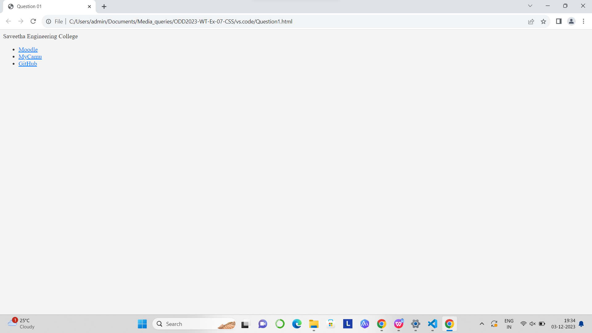

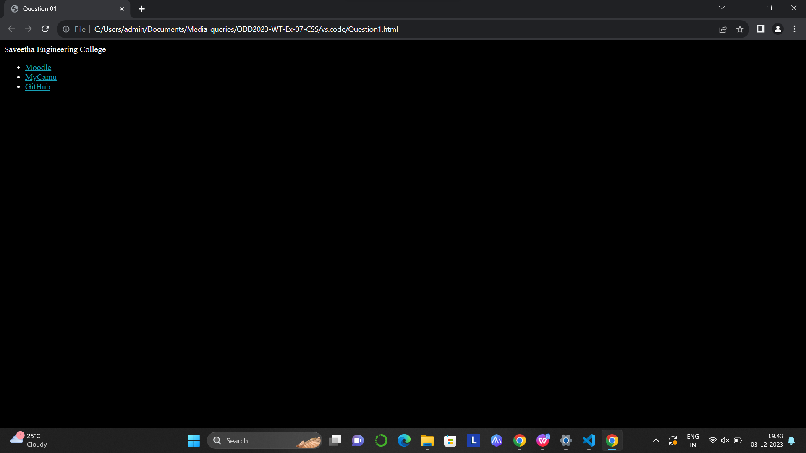

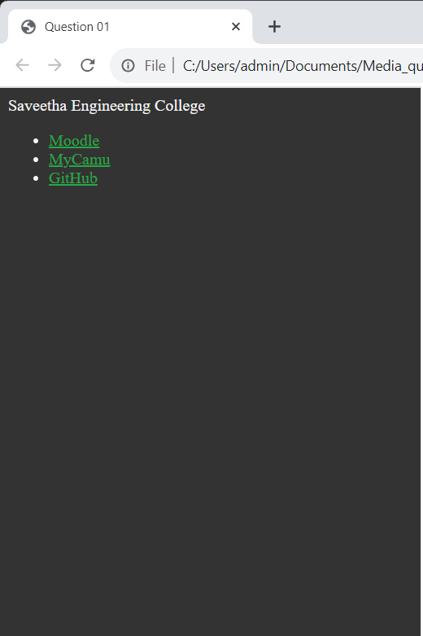

## QUESTION 2 :

How would you use a media query in CSS to apply different styles to a webpage for mobile devices (with widths less than 600px) and desktop devices (with widths greater than or equal to 600px)? Provide an example CSS snippet to demonstrate your answer.

## DESIGN STEPS :
### Step 1 : Create HTML Structure
Create the HTML code with root element.
### Step 2 :Define Default Styles
Set the default styles for your webpage that will be applied to all devices.
### Step 3 : Apply Media Query for Mobile Devices (Max-width: 600px)
Use a media query to adjust styles as needed for a mobile-friendly layout.
### Step 4 : Apply Media Query for Desktop Devices (Min-width: 601px)
Use another media query to adjust styles for a larger screen.
### Step 5 : End the code
End the html code by closing all the open tages.

## PROGRAM :
```
<!DOCTYPE html>
<html>
<head>
<title>Question 2:</title>
<style>
@media only screen and (max-width: 599px) {
  body {
    background-color: lightblue;
    font-size: 14px;
  }
  a {
    color: red;
  }
}
@media only screen and (min-width: 600px) {
  body {
    background-color: lightgreen;
    font-size: 16px;
  }
  a {
    color: red;
  }
}
</style>
</head>
<body>
<div>Saveetha Engineering College</div>
<ul>
<li><a href="http://lms.ai.saveetha.ac.in/my/">Moodle</a></li>
<li><a href="https://www.mycamu.co.in/">MyCamu</a></li>
<li><a href="https://github.com/">GitHub</a></li>
</ul>
</body>
</html>
```
## OUTPUT :

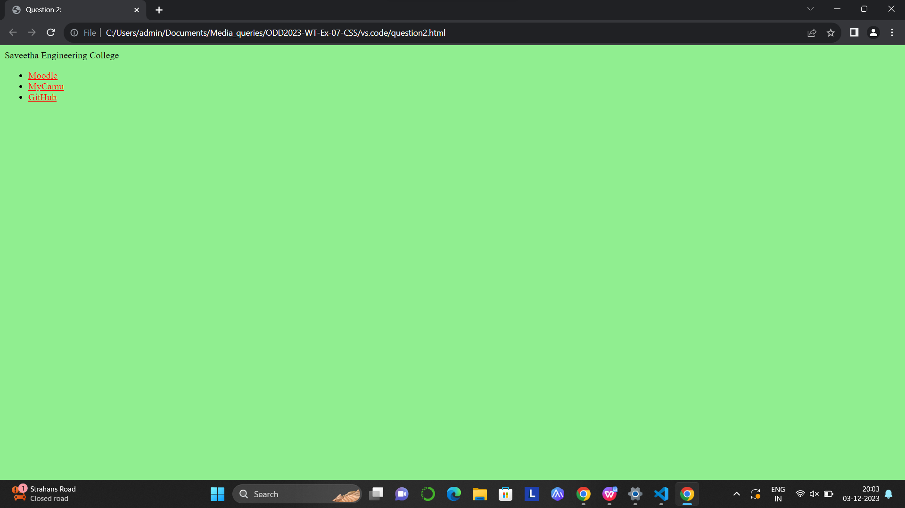

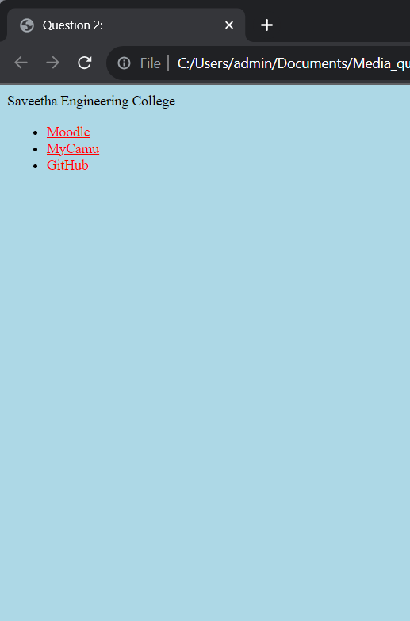

## QUESTION 3 : Orientation-based Media Query

Explain how you can use CSS media queries to apply different styles based on the orientation (landscape or portrait) of the device. Provide a CSS example where you change the background color of the body based on the orientation.

## DESIGN STEPS :
### Step 1 : Create HTML Structure
Create the HTML code with root element.
### Step 2 : Set Default Styles:
Define the default styles for your webpage.
### Step 3 : Apply Media Query for Landscape Orientation
Use a media query to target devices in landscape orientation. Adjust styles accordingly.
### Step 4 : Apply Media Query for Portrait Orientation
Use another media query to target devices in portrait orientation. Adjust styles accordingly.
### Step 5 : End the code
End the html code by closing all the open tages.

## PROGRAM :
```
<!DOCTYPE html>
<html>
<head>
<title>Question 3:</title>
<style>
@media only screen and (orientation: portrait) {
  body {
    background-color: teal;
    color: black;
  }
  a {
    color: yellow;
  }
}
@media only screen and (orientation: landscape) {
  body {
    background-color: royalblue;
    color: black;
  }
  a {
    color: yellow;
  }
}
</style>
</head>
<body>
<div>Saveetha Engineering College</div>
<ul>
<li><a href="http://lms.ai.saveetha.ac.in/my/">Moodle</a></li>
<li><a href="https://www.mycamu.co.in/">MyCamu</a></li>
<li><a href="https://github.com/">GitHub</a></li>
</ul>
</body>
</html>
```
## OUTPUT :

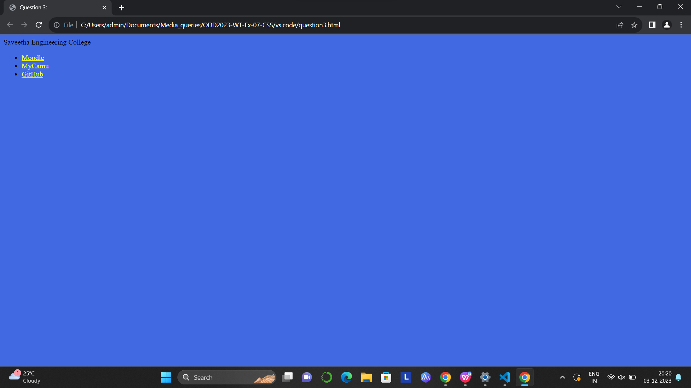

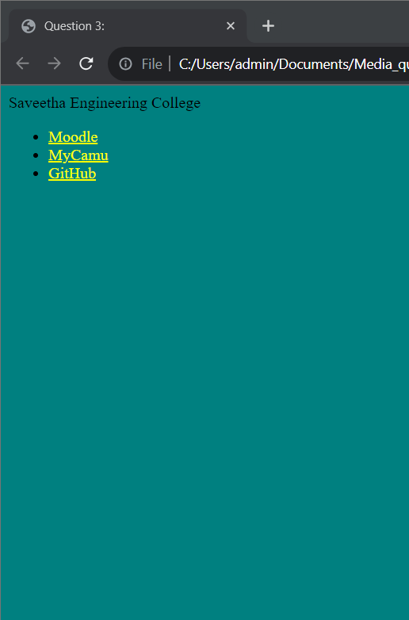

## QUESTION 4 : Responsive Typography

Describe how you would use media queries to adjust typography (like font size and line spacing) on a website to improve readability across different device sizes, from mobile phones to large desktop monitors. Include a CSS code snippet in your explanation.

## DESIGN STEPS :
### Step 1 : Create HTML Structure
Create the HTML code with root element.
### Step 2 : Define Default Typography Styles
Set the default typography styles for your website.
### Step 3 : Apply Media Queries for Small Screens (Mobile)
Use media queries to adjust font size and line spacing for small screens like mobiles.
### Step 4 : Apply Media Queries for Medium Screens (Tablets)
Use a new media queries adjust font size and line spacing for medium screens (tablets).
### Step 5 : Apply Media Queries for Large Screens (Desktops)
Continue with media queries for larger screens.
### Step 6 : End the code
End the html code by closing all the open tages.

## PROGRAM :
```
<!DOCTYPE html>
<html>
<head>
<title>Question 4:</title>
<style>
@media only screen and (max-width: 767px) {
  body {
    font-size: 14px;
    line-height: 1.4;
  }
  h1 {
    font-size: 24px;
  }
}
@media only screen and (min-width: 768px) {
  body {
    font-size: 16px;
    line-height: 1.6;
  }

  h1 {
    font-size: 36px;
  }
}
@media only screen and (min-width: 1200px) {
  body {
    font-size: 18px;
    line-height: 1.8;
  }

  h1 {
    font-size: 48px;
  }
}
</style>
</head>
<body>
<div>Saveetha Engineering College</div>
<ul>
<li><a href="http://lms.ai.saveetha.ac.in/my/">Moodle</a></li>
<li><a href="https://www.mycamu.co.in/">MyCamu</a></li>
<li><a href="https://github.com/">GitHub</a></li>
</ul>
</body>
</html>
```
## OUTPUT :

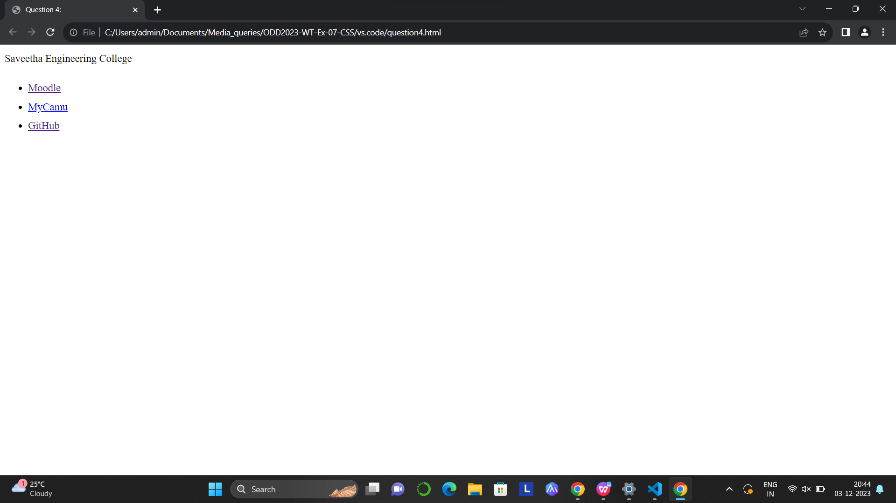

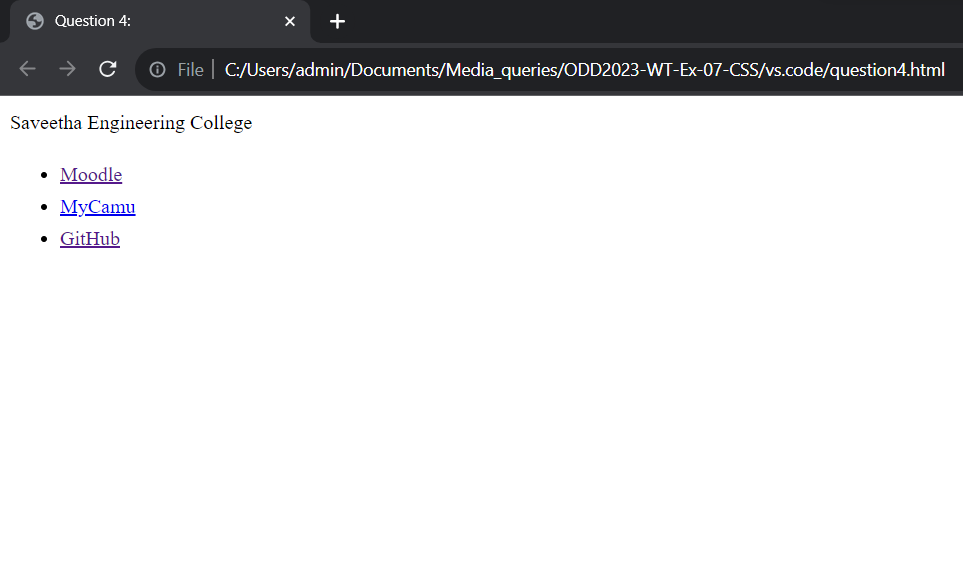

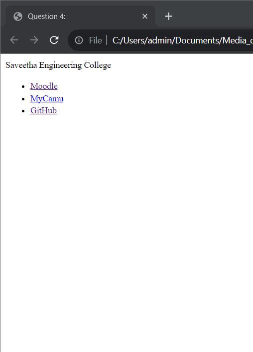

## QUESTION 5 : Print-friendly CSS

Media queries can be used to provide print-friendly styles for web pages. How would you use a media query to change the styling of a webpage when it is printed, such as changing the background to white and hiding non-essential elements? Provide a CSS example.

## DESIGN STEPS :
### Step 1 : Create HTML Structure
Create the HTML code with root element.
### Step 2 : Set Default Styles
Define the default styles for your webpage.
### Step 3 : Apply Media Query for Print Styles
Use a media query (@media print) to modify the appearance of the page when it's printed.
### Step 4 : End the code
End the html code by closing all the open tages.

## PROGRAM :
```
<html>
<head>
<title>Question 05</title>
<style>
    div, li {
        font-size: 14px;
        line-height: 1;
    }

    @media print {
        body {
            background-color: white;
        }

        div, li {
            font-size: 12px;
            line-height: 1.4;
        }

        
        .non-essential {
            display: none;
        }
    }
</style>
</head>
<body>
    <div>
    Saveetha Engineering College
  </div>
    <ul>
        <li><a href="http://lms.ai.saveetha.ac.in/my/">Moodle</a></li>
        <li><a href="https://www.mycamu.co.in/">MyCamu</a></li>
        <li><a href="https://www.github.com">GitHub</a></li>
    </ul>
  </body>
  </html>
  ```
  ## OUTPUT :

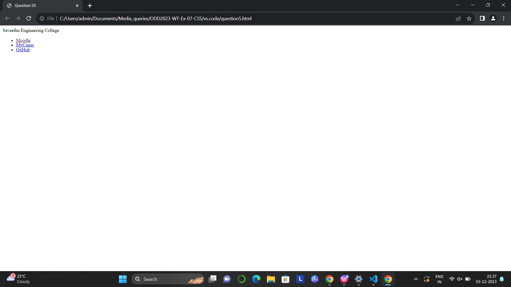

## QUESTION 6 : Dark Mode Implementation

With the increasing popularity of dark mode in user interfaces, explain how you would use a media query to detect if the user has set their system to prefer a dark color scheme. Provide an example of how you would change the background and text colors of a website based on this preference.

## DESIGN STEPS :
### Step 1 : Create HTML Structure
Create the HTML code with root element.
### Step 2 : Define Default Styles
Set the default styles for your webpage, including background and text colors.
### Step 3 : Apply Media Query for Dark Mode Preference
Use a media query (@media (prefers-color-scheme: dark)) to detect if the user has set their system to prefer a dark color scheme.
### Step 4 : Apply Media Query for Light Mode Preference
Use another media query (@media (prefers-color-scheme: light)) to detect if the user has set their system to prefer a light color scheme.
### Step 5 : End the code
End the html code by closing all the open tages.

## PROGRAM :
```
<!DOCTYPE html>
<html>
<head>
<title> Question 06 </title>
<style>
    @media (prefers-color-scheme: dark) {
        body {
            background-color: black;
            color: white;
        }
        a {
         color: white;
         }
    }
    @media (prefers-color-scheme: light) {
        body {
            background-color: white;
            color: black;
        }
        a {
         color: black;
         }
    }
</style>
</head>
<body>
    <div>
    Saveetha Engineering College
  </div>
    <ul>
        <li><a href="http://lms.ai.saveetha.ac.in/my/">Moodle</a></li>
        <li><a href="https://www.mycamu.co.in/">MyCamu</a></li>
        <li><a href="https://www.github.com">GitHub</a></li>
    </ul>
  </body>
  </html>
  ```
  ## OUTPUT :

  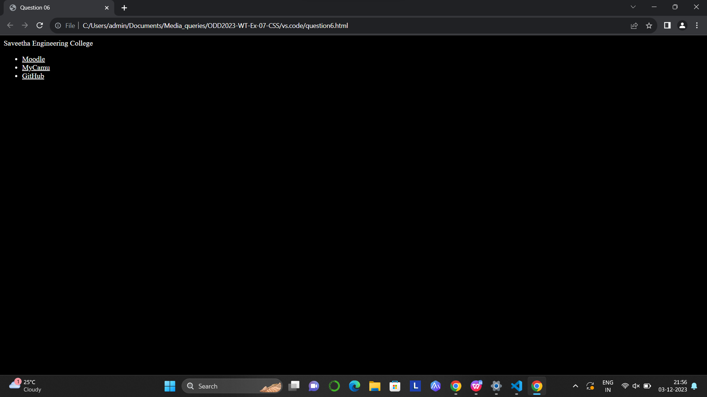

  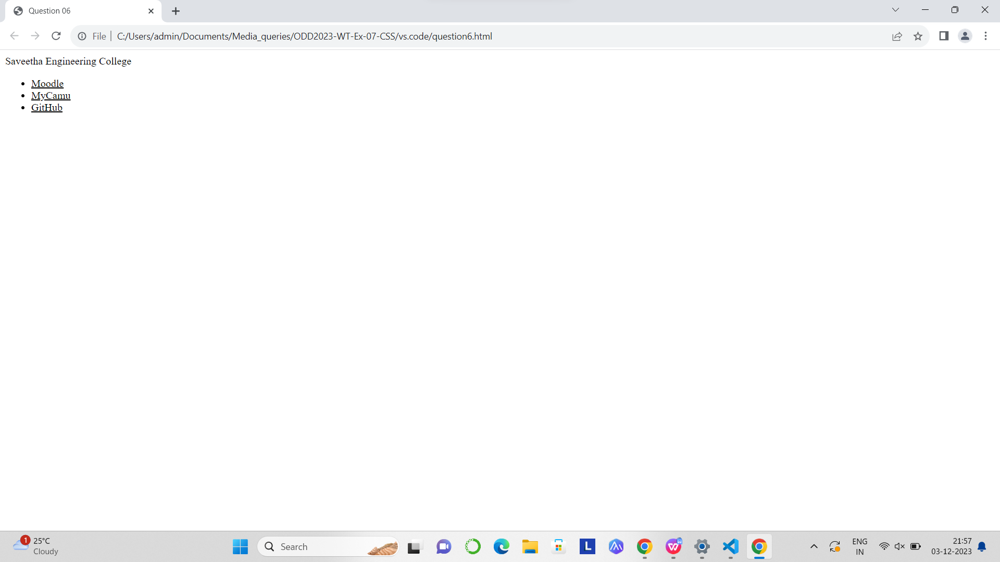

  ## RESULT : 
  The expected output for all the given codes has been executed successfully. 

